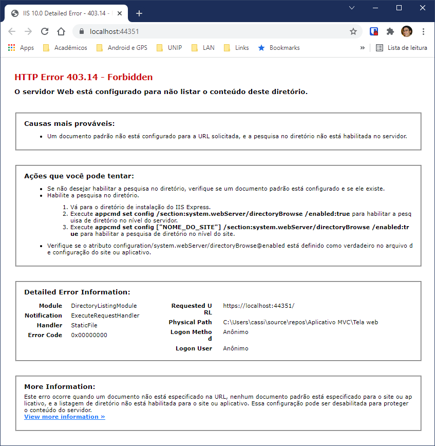
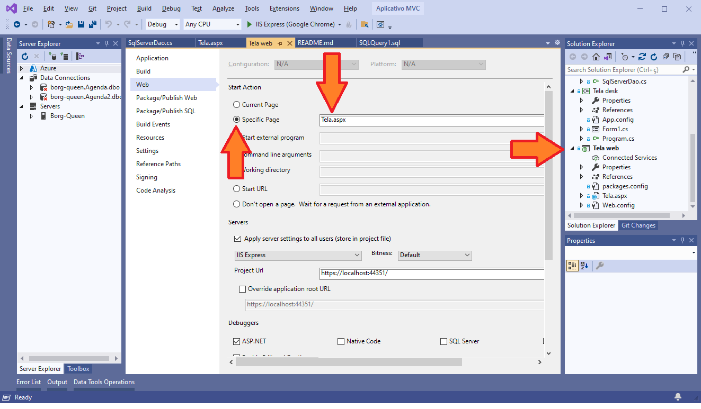

# Aplicativo-MVC
Um tutorial para a criação de um aplicativo em arquitetura MVC, com GUIs desktop e web e com acesso a banco de dados.
## Tutorial
Consulte o tutorial [aqui](Docs).
## Configuração da Página Inicial
Após clonar o repositório ou em alguns outros casos que alunos me reportaram, o aplicativo WEB pode não encontrar a página inicial do site, apresentando uma mensagem de erro semelhante à abaixo.

Para resolver este problema, clique com o botão direito do mouse sobre seu projeto "Tela web", selecione [Propriedades]. Na página que se abre, vá para a aba "Web", na seção "Página de Inicialização" selecione [Página específica] e selecione a sua página "Tela.aspx" conforme a figura abaixo.

